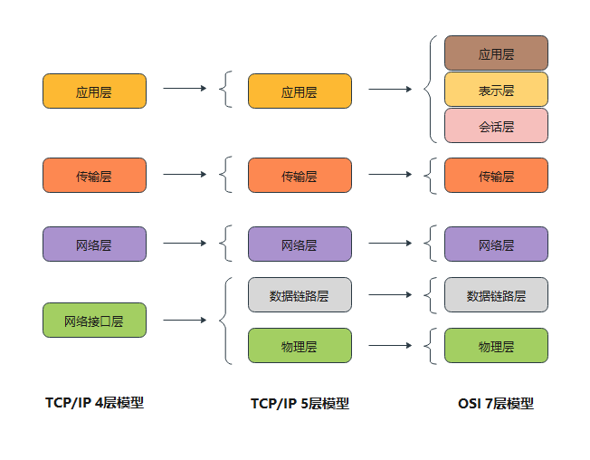

## 什么是网络编程

packet包和邮件的思想类似

TCP连接

UDP连接

+ 计算机网络：计算机网络是指将地理位置不同的具有独立功能的多台计算机及其外部设备，通过通信线路连接起来，在网络操作系统，网络管理软件及网络通信协议的管理和协调下，实现资源共享和信息传递的计算机系统。（不同地理位置计算机，通过线路连接，在通信软件和协议的协调下，实现资源共享）

+ 网络编程的目的：传播交流信息、数据交换、通信
+ 需要解决的问题：
    + 如何准确的定位到网络上的一台主机，端口，定位到计算机上的某个资源
    + 找到这个主机，如何传输资源。

JavaWeb：网页编程 B/S

网络编程：TCP/IP

## 网络通信的要素

通信双方地址

+ ip
+ 端口号

规则：网络通信协议

+ TCP/IP四层模型
+ OSI七层网络模型



## IP

ip地址：InetAdress

+ 唯一定位一台网络上的计算机
+ 127.0.0.1：本机localhost，本机回环地址
+ IP地址：
  + IPV4/IPV6
    + IPV4：127.0.0.1 4个字节组成 0-255，42亿个，30亿在北美，亚洲4亿，2011年用尽。
    + IPV6：fe80::489:aab1:a507:2b83%en0，128位，8个无符号整数。
  + 公网（互联网）-私网（局域网）
    + 129.168.xx.xx专门给组织内部使用的
    + ABCDE类地址计算：对半分，可以计算出来，阿里的笔试题中有。
+ 域名：记忆问题引入域名。

## 端口

端口：表示计算机上的每一个程序的进程

+ 不同的进程有不同的端口号。用来区分软件。
+ 端口被规定0-65535
+ TCP端口、UDP端口。65535*2，tcp和udp的端口号不冲突。
+ 端口分类
  + 公有端口0~1023
    + HTTP：80
    + HTTPS：443
    + FTP：21
    + Telent：23
  + 程序注册端口：1024~49151，分配给用户或者程序
    + Tomcat：8080
    + MySql：3306
    + Oracle：1521
  + 动态、私有端口：49512~65535
    + `lsof`  查看端口
    + `leof -i:8080 `查看指定端口被占用情况
    + `kill pid`杀死对应端口进程

## 通信协议

协议：TCP/IP协议

网络通信协议：速率、传输码率、代码结构、传输控制等

TCP/IP协议簇：实际上是一组协议

+ TCP：用户传输协议
+ UDP：用户数据报协议
+ IP：网络互连协议

TCP和UDP对比：

TCP：

+ 连接、文档
+ 三次握手 四次挥手
+ 客户端、服务端
+ 传输完成，释放连接、效率低

UDP：

+ 不连接、不稳定
+ 客户端、服务端，没有明确界限
+ 不管有没有准备好，都可以发送
+ DDoS攻击：网络阻塞，导致端口不可用

## TCP

客户端Client

+ 连接服务器Socket
+ 发送消息

服务器Server

+ 建立服务的端口ServerSocket
+ 等待用户的连接，accept
+ 接收用户的消息

```
服务端：
public class Server {

    public static void main(String[] args) {
        ServerSocket serverSocket = null;
        Socket socket = null;
        InputStream inputStream = null;
        ByteOutputStream byteOutputStream = null;
        try {
            serverSocket = new ServerSocket(12340);
            while (true) {
                socket = serverSocket.accept();
                inputStream = socket.getInputStream();
                byteOutputStream = new ByteOutputStream();
                byte[] buffer = new byte[1024];
                int length = 0;
                while ((length = inputStream.read(buffer)) != -1) {
                    byteOutputStream.write(buffer, 0, length);
                }
                System.out.println(byteOutputStream.toString());
            }
        } catch (IOException e) {
            throw new RuntimeException(e);
        } finally {
            if (byteOutputStream != null) {
                byteOutputStream.close();
            }
            if (inputStream != null) {
                try {
                    inputStream.close();
                } catch (IOException e) {
                    e.printStackTrace();
                }
            }
            if (socket != null) {
                try {
                    socket.close();
                } catch (IOException e) {
                    e.printStackTrace();
                }
            }
            if (serverSocket != null) {
                try {
                    serverSocket.close();
                } catch (IOException e) {
                    e.printStackTrace();
                }
            }
        }
    }
}
```

```
客户端：
public class Client {

    public static void main(String[] args) throws IOException {
        InetAddress localHost = InetAddress.getLocalHost();
        Socket socket = new Socket(localHost, 12340);
        OutputStream outputStream = socket.getOutputStream();
        outputStream.write("hello".getBytes());
        outputStream.close();
        socket.close();
    }

}
```

发送文件

```
package network.FileDownLoad;

import java.io.FileOutputStream;
import java.io.IOException;
import java.io.InputStream;
import java.io.OutputStream;
import java.net.ServerSocket;
import java.net.Socket;

/**
 * @author: luu
 * @date: 2021-01-15 16:43
 **/
public class DownloadFile {

    public static void main(String[] args) throws IOException {
        // 建立一个socket服务器
        ServerSocket serverSocket = new ServerSocket(9999);
        // 等待获取连接
        Socket socket = serverSocket.accept();
        // 获取socket的资源
        InputStream socketIn = socket.getInputStream();
        // 将文件存储
        FileOutputStream fileOut = new FileOutputStream("copyPicture.jpeg");
        byte[] buffer = new byte[1024];
        int length = 0;
        while ((length = socketIn.read(buffer)) != -1) {
            fileOut.write(buffer, 0 , length);
        }
        // 存储成功通知
        OutputStream socketOut = socket.getOutputStream();
        socketOut.write("上传成功！".getBytes());

        // 关闭资源
        socketOut.close();
        fileOut.close();
        socketIn.close();
        socket.close();
        serverSocket.close();
    }

}
```

```
package network.FileDownLoad;

import java.io.*;
import java.net.InetAddress;
import java.net.Socket;

/**
 * @author: luu
 * @date: 2021-01-15 16:42
 **/
public class UploadFile {

    public static void main(String[] args) throws IOException {
        // 建立socket连接
        Socket socket = new Socket(InetAddress.getByName("127.0.0.1"), 9999);
        // 获取上传的文件
        FileInputStream fileIn = new FileInputStream("myPicture.jpeg");
        // 上传
        byte[] buffer = new byte[1024];
        int length = 0;
        OutputStream socketOut = socket.getOutputStream();
        while ((length = fileIn.read(buffer)) != -1) {
            socketOut.write(buffer, 0, length);
        }
        // 上传成功关闭输出流
        socket.shutdownOutput();
        // 等待服务器通知
        InputStream socketIn = socket.getInputStream();
        ByteArrayOutputStream out = new ByteArrayOutputStream();
        while ((length = socketIn.read(buffer)) != -1) {
            out.write(buffer, 0, length);
        }
        System.out.println(out.toString());
        // 关闭资源
        out.close();
        socketIn.close();
        fileIn.close();
        socket.close();
    }

}
```

## Tomcat

服务端

## UDP

不用连接，需要知道对方的地址。

+ `DatagramPacket`数据报包
+ `DatagramSocket`

```
package network.udp;

import java.io.IOException;
import java.net.*;

/**
 * @author: luu
 * @date: 2021-01-15 18:14
 **/
public class UDPClientOne {

    public static void main(String[] args) throws IOException {
        DatagramSocket datagramSocket = new DatagramSocket(9999);
        String words = "hello world";
        DatagramPacket datagramPacket = new DatagramPacket(words.getBytes(), 0, words.length(), InetAddress.getByName("127.0.0.1"), 9998);
        datagramSocket.send(datagramPacket);
        datagramSocket.close();
    }

}
```

```
package network.udp;

import java.io.IOException;
import java.net.DatagramPacket;
import java.net.DatagramSocket;

/**
 * @author: luu
 * @date: 2021-01-15 18:14
 **/
public class UDPClientTwo {

    public static void main(String[] args) throws IOException {
        DatagramSocket datagramSocket = new DatagramSocket(9998);
        byte[] buffer = new byte[1024];
        DatagramPacket datagramPacket = new DatagramPacket(buffer, 0, buffer.length);
        datagramSocket.receive(datagramPacket);
        System.out.println(new String(datagramPacket.getData()));
        datagramSocket.close();
    }

}
```

聊天程序

发送消息类：

```
package network.chat;

import java.io.BufferedReader;
import java.io.IOException;
import java.io.InputStreamReader;
import java.net.DatagramPacket;
import java.net.DatagramSocket;
import java.net.InetAddress;
import java.net.SocketException;

/**
 * @author: luu
 * @date: 2021-01-15 20:25
 **/
public class Send implements Runnable {

    private DatagramSocket datagramSocket;
    private String toIP;
    private int toPort;
    private String nickName;

    public Send(String toIP, int toPort, int ownPort, String nickName) {
        this.toIP = toIP;
        this.toPort = toPort;
        this.nickName = nickName;
        try {
            this.datagramSocket = new DatagramSocket(ownPort);
        } catch (SocketException e) {
            throw new RuntimeException(e);
        }
    }

    @Override
    public void run() {
        String message;
        BufferedReader in = new BufferedReader(new InputStreamReader(System.in));
        try {
            while (true) {
                byte[] messages = (nickName + " : " + in.readLine()).getBytes();
                DatagramPacket datagramPacket = new DatagramPacket(messages, messages.length, InetAddress.getByName(toIP), toPort);
                datagramSocket.send(datagramPacket);
                System.out.println("发送到" + toIP + ":" + toPort + "，消息" + " - " + new String(datagramPacket.getData()) + " - " + "发送成功！");
            }
        } catch (IOException e) {
            throw new RuntimeException(e);
        } finally {
            datagramSocket.close();
        }
    }
}
```

接收消息类

```
package network.chat;

import java.io.IOException;
import java.net.DatagramPacket;
import java.net.DatagramSocket;
import java.net.SocketException;

/**
 * @author: luu
 * @date: 2021-01-15 20:26
 **/
public class Receive implements Runnable {

    private DatagramSocket datagramSocket;

    public Receive(int ownIp) {
        try {
            this.datagramSocket = new DatagramSocket(ownIp);
        } catch (SocketException e) {
            throw new RuntimeException(e);
        }
    }

    @Override
    public void run() {
        byte[] buffer = new byte[2048];
        try {
            while (true) {
                DatagramPacket datagramPacket = new DatagramPacket(buffer, buffer.length);
                datagramSocket.receive(datagramPacket);
                System.out.println(new String(datagramPacket.getData(), 0, datagramPacket.getLength()));
            }
        } catch (IOException e) {
            throw new RuntimeException(e);
        } finally {
            datagramSocket.close();
        }
    }
}
```

客户端一

```
package network.chat;

import java.util.concurrent.ExecutorService;
import java.util.concurrent.Executors;

/**
 * @author: luu
 * @date: 2021-01-15 21:04
 **/
public class ChatOne {

    public static void main(String[] args) {
        ExecutorService threadPool = Executors.newFixedThreadPool(2);
        threadPool.submit(new Send("127.0.0.1", 11001, 11002, "小王"));
        threadPool.submit(new Receive(11000));
    }

}
```

客户端二

```
package network.chat;

import java.util.concurrent.ExecutorService;
import java.util.concurrent.Executors;

/**
 * @author: luu
 * @date: 2021-01-15 21:11
 **/
public class ChatTwo {

    public static void main(String[] args) {
        ExecutorService threadPool = Executors.newFixedThreadPool(2);
        threadPool.submit(new Send("127.0.0.1", 11000, 11003, "小张"));
        threadPool.submit(new Receive(11001));
    }

}
```

## URL

统一资源定位符：定位资源，定位互联网上的某一个资源。

`https://www.baidu.com`

```
协议://IP地址:端口/资源/参数
```

下载网络资源

```
package network;

import java.io.FileOutputStream;
import java.io.IOException;
import java.io.InputStream;
import java.net.MalformedURLException;
import java.net.URL;

/**
 * @author: luu
 * @date: 2021-01-15 21:39
 **/
public class UrlDownload {

    public static void main(String[] args) throws IOException {
        URL url = new URL("https://m10.music.126.net/20210115220624/95a4f4eded8f5d962ff157686275f38d/yyaac/0708/0652/0508/0b9b6827b718aa223af92bd52aa2424f.m4a");
        InputStream in = url.openStream();
        FileOutputStream out = new FileOutputStream("世间美好与你环环相扣.m4a");
        byte[] buffer = new byte[2048];
        int length = 0;
        while ((length = in.read(buffer)) != -1) {
            out.write(buffer, 0, length);
        }
        out.close();
        in.close();
    }

}
```

