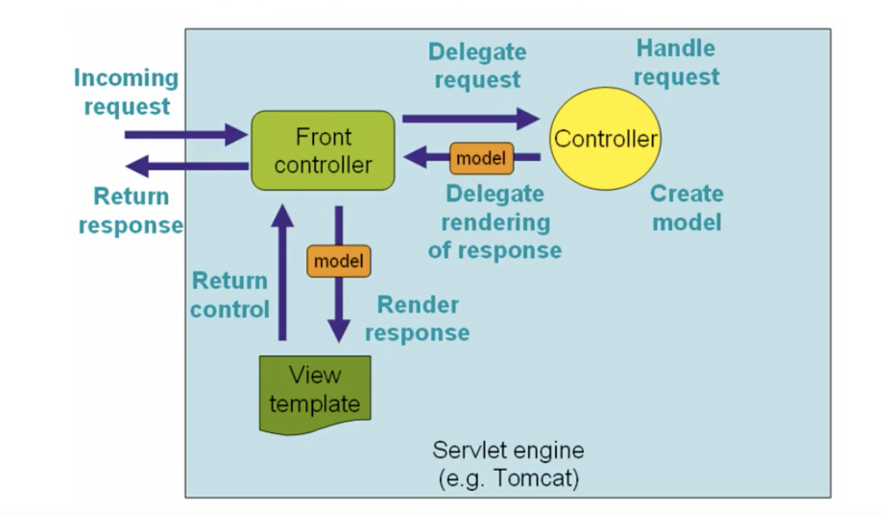

## SpringMVC

MVC：

+ model
+ view
+ control

优点：

1. 轻量级、简单易学
2. 高效，基于请求响应的MVC框架
3. 与Spring兼容性好，无缝结合
4. 约定优于配置
5. 功能强大：RESTful、数据验证、格式化、本地化、主题等
6. 简洁灵活

## 围绕DispatcherServlet实现

`DispatcherServlet`的作用是将请求分发到不同的处理器。

## SpringMVC注解开发

@Controller

## RESTful风格

+ 简洁
+ 高效
+ 安全

get、post、delete、put

## Filter解决乱码问题

## JSON

## AJAX

## 拦截器

 