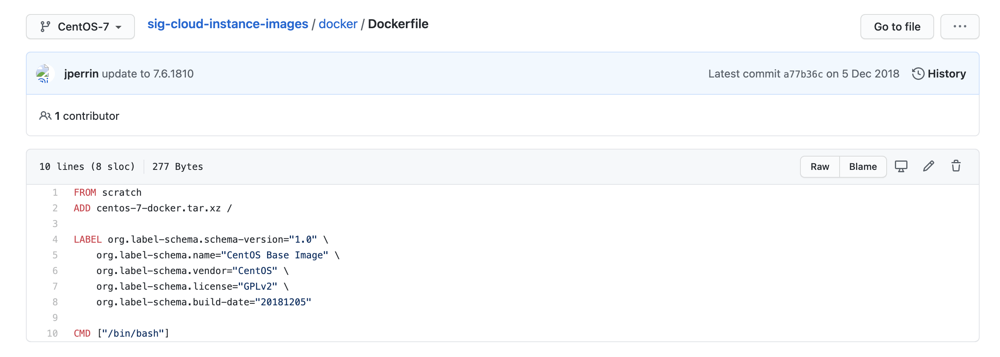

## docker概述

> docker为什么会出现

开发，运维，开发上线两套环境。

开发即运维

环境配置是十分麻烦的，每一个机器都要部署环境（redis、es、hadoop...）

现在：开发打包部署上线，一套流程做完。

docker打包完成后可以发布到docker仓库，需要使用的人直接从仓库下载并安装即可使用。

docker给以上问题给出了解决方案！

docker的思想来自于集装箱

隔离：docker核心思想，打包装箱，每个箱子是相互隔离的。

Docker通过隔离机制，可以将服务器利用到极致。

> docker的历史

2010年，几个年轻人成立了一家公司`dotCloud`

做一些pass的云计算服务

将自己的技术容器化话技术命名为docker

因为活不下去，选择开源！

2013年开源，越来越多的人发现docker好用。

2014年4月9日docker发布1.0版本

docker十分轻巧

在容器技术出现之前我们都是使用虚拟机技术。

虚拟机：笨重 -- 属于一种虚拟化技术

容器：docker容器技术，也是一种虚拟化技术

到现在，基本所有的开发人员都需要会docker

docker基于go语言开发的

官方文档地址：https://docs.docker.com/

dockerhub地址：https://hub.docker.com/

> docker能做什么

虚拟机技术缺点：

1. 资源占用十分多
2. 冗余步骤很多
3. 启动很慢

容器化技术:

1. 传统虚拟机虚拟出一套硬件，运行一个完整的操作系统
2. 容器是直接运行在宿主机的内核中，容器是没有自己的内核的，没有虚拟硬件。
3. 每个容器间是互相隔离的，每个容器都有自己的一个文件系统，互不影响。

> DevOps开发运维

1. 更快速的交付和部署
   1. docker打包镜像发布测试，一键运行
   2. 传统一堆帮助文档安装程序
2. 更便捷的升级和扩容缩容
   1. 使用docker后和搭积木一样
   2. 项目打包为一个镜像，扩容服务器
3. 更简单的系统运维
   1. 在容器化之后，我们的开发，测试环境都是高度一致的
4. 更高效的计算资源利用
   1. docker是内核级别的虚拟化
   2. 可以在一个物理机上运行很多的容器实例
   3. 服务器的性能可以被利用到极致

## docker安装

> docker的基本组成

1. 镜像（image）：相当于一个模板，可以通过这个模板可以创建容器服务，通过这个镜像可以创建多个容器。
2. 容器（container）：利用容器技术，可以独立运行一个或者一组应用，通过镜像来创建。容器可以启动停止删除。开始的就可以把这个容器理解为简易的linux系统。
3. 仓库（repository）：仓库就是存放镜像的地方。仓库分为公有仓库和私有仓库。dockerhub，国内各个云厂商。

> 安装docker

**环境准备：**

1. 需要Linux基础
2. centOS 7
3. 使用远程连接工具连接远程服务器

**查看环境：**

```
cat /etc/os-release 

NAME="CentOS Linux"
VERSION="7 (Core)"
ID="centos"
ID_LIKE="rhel fedora"
VERSION_ID="7"
PRETTY_NAME="CentOS Linux 7 (Core)"
ANSI_COLOR="0;31"
CPE_NAME="cpe:/o:centos:centos:7"
HOME_URL="https://www.centos.org/"
BUG_REPORT_URL="https://bugs.centos.org/"

CENTOS_MANTISBT_PROJECT="CentOS-7"
CENTOS_MANTISBT_PROJECT_VERSION="7"
REDHAT_SUPPORT_PRODUCT="centos"
REDHAT_SUPPORT_PRODUCT_VERSION="7"
```

**安装**：参考官方文档

```
#1卸载旧版本
$ sudo yum remove docker \
                  docker-client \
                  docker-client-latest \
                  docker-common \
                  docker-latest \
                  docker-latest-logrotate \
                  docker-logrotate \
                  docker-engine
                  
#2需要的安装包
yum install -y yum-utils

#3设置镜像仓库
yum-config-manager \
    --add-repo \
    https://download.docker.com/linux/centos/docker-ce.repo #默认是国外的
    
    yum-config-manager \
    --add-repo \
    http://mirrors.aliyun.com/docker-ce/linux/centos/docker-ce.repo
    
# 更新yum软件包索引，类似brew的更新
yum makecache fast

#4安装docker引擎 docker-ce是社区版 ee企业版
yum install docker-ce docker-ce-cli containerd.io

#5启动docker
systemctl start docker

#6使用docker -version查看

#7运行hello world
docker run hello-world

#8查看镜像
docker images
[root@wang /]# docker images
REPOSITORY    TAG       IMAGE ID       CREATED         SIZE
hello-world   latest    bf756fb1ae65   13 months ago   13.3kB

```

```
docker卸载
#1卸载依赖
yum remove docker-ce docker-ce-cli containerd.io

#2删除目录
rm -rf /var/lib/docker #docker的默认工作路径
```

## 配置阿里云镜像加速

1. 登录阿里云
2. 找到容器镜像服务
3. 找到镜像加速器

配置使用

```
sudo mkdir -p /etc/docker
sudo tee /etc/docker/daemon.json <<-'EOF'
{
  "registry-mirrors": ["https://oh1j6h7a.mirror.aliyuncs.com"]
}
EOF
sudo systemctl daemon-reload
sudo systemctl restart docker
```

## docker原理

>  docker run 的运行流程

1. 先在本地查找是否有对应的镜像
2. 如果有直接启动，如果没有去远程仓库查找
3. 如果远程仓库有，下载到本地
4. 如果远程仓库没有，会报错退出
5. 下载到本地之后运行镜像

> 底层原理

docker是一个client - service结构的系统，docker的守护进程运行在主机上，通过socker从客户端访问。

dockerServer介绍到docker-client的指令，就会执行这个命令。

> docker为什么比vm快

docker比虚拟机更少的抽象层

所以说，新建一个容器的时候，docker不需要像虚拟机一样重新加载一个操作系统，避免引导加载操作系统，分钟级别的，而docker是利用宿主机进程。

## docker的常用命令

```
docker version
docker info 显示docker的系统信息
docker 命令 --help
```

官网文档：https://docs.docker.com/reference/

> 镜像命令

```bash
docker images # 查看所有本地主机上的镜像

REPOSITORY    TAG       IMAGE ID       CREATED         SIZE
hello-world   latest    bf756fb1ae65   13 months ago   13.3kB

Usage:  docker images [OPTIONS] [REPOSITORY[:TAG]]

List images

Options:
  -a, --all             Show all images (default hides intermediate images)
      --digests         Show digests
  -f, --filter filter   Filter output based on conditions provided
      --format string   Pretty-print images using a Go template
      --no-trunc        Don't truncate output
  -q, --quiet           Only show image IDs
```

```
docker search 镜像名 #搜索镜像

NAME                              DESCRIPTION                                     STARS     OFFICIAL   AUTOMATED
mysql                             MySQL is a widely used, open-source relation…   10468     [OK]       
mariadb                           MariaDB is a community-developed fork of MyS…   3893      [OK]       

docker search [OPTIONS] TERM

Search the Docker Hub for images

Options:
  -f, --filter filter   Filter output based on conditions provided
      --format string   Pretty-print search using a Go template
      --limit int       Max number of search results (default 25)
      --no-trunc        Don't truncate output
```

```
docker pull 镜像名 # 下载镜像

docker pull [OPTIONS] NAME[:TAG|@DIGEST]

Pull an image or a repository from a registry

Options:
  -a, --all-tags                Download all tagged images in the repository
      --disable-content-trust   Skip image verification (default true)
      --platform string         Set platform if server is multi-platform capable
  -q, --quiet                   Suppress verbose output
  
如果不使用tag的话会默认使用latest
docker pull mysql:5.7 # 带版本号下载
```

```
docker rmi -f 镜像id #删除镜像
docker rmi -f $(docker images -aq) #递归删除所有
```

> 容器命令

有镜像才可以创建容器，linux，下载一个centos镜像来测试学习

```
docker pull centos
```

```
docker run [OPTIONS] IMAGE [COMMAND] [ARG...] 启动一个镜像

#参数说明
--name="name" 容器名字
-d 后台运行方式 java是nohup方式
-it 使用交互方式运行，进入容器，查看内容
-p 指定容器端口
 -p 主机端口：容器端口（常用）
 -p 容器端口
 -p ip：容器端口

docker run -it centos /bin/bash #启动并进入容器
exit #退出容器并停止
ctrl + p + q #不停止容器并退出
```

```
docker ps #查看运行的容器
-a 查看所有运行过的容器
-n=? 显示最近创建的容器
-q 只显示容器的编号
```

```
删除容器
docker rm 容器id
docker rm -f $(docker ps -aq) 递归删除所有的容器
docker ps -a -q|xargs docker rm #删除所有容器

```

```
启动和停止容器
docker start 容器id
docker restart 容器id
docker stop 容器id
docker kill 容器id
```

## docker常用其他命令

```
后台启动容器
docker run -d centos 
问题docker ps 发现centos停止
docker容器使用后台运行，必须要有一个前台进程，docker发现没有应用，就会自动停止
```

```
查看日志
docker logs [OPTIONS] CONTAINER

Fetch the logs of a container

Options:
      --details        Show extra details provided to logs
  -f, --follow         Follow log output
      --since string   Show logs since timestamp (e.g. 2013-01-02T13:23:37Z) or relative
                       (e.g. 42m for 42 minutes)
  -n, --tail string    Number of lines to show from the end of the logs (default "all")
  -t, --timestamps     Show timestamps
      --until string   Show logs before a timestamp (e.g. 2013-01-02T13:23:37Z) or relative
                       (e.g. 42m for 42 minutes)b
```

```
查看容器里的进程信息
docker top 容器id
```

```
查看镜像源数据
docker inspect 容器id

[
    {
        "Id": "d660022933059d9a4049a3f0debf44e594194a47914de8037c1738aafabdad55",
        "Created": "2021-02-06T10:07:05.100245576Z",
        "Path": "/bin/bash",
        "Args": [],
        "State": {
            "Status": "exited",
            "Running": false,
            "Paused": false,
            "Restarting": false,
            "OOMKilled": false,
            "Dead": false,
            "Pid": 0,
            "ExitCode": 0,
            "Error": "",
            "StartedAt": "2021-02-06T10:07:05.436884807Z",
            "FinishedAt": "2021-02-06T10:08:21.697194417Z"
        },
        "Image": "sha256:300e315adb2f96afe5f0b2780b87f28ae95231fe3bdd1e16b9ba606307728f55",
        "ResolvConfPath": "/var/lib/docker/containers/d660022933059d9a4049a3f0debf44e594194a47914de8037c1738aafabdad55/resolv.conf",
        "HostnamePath": "/var/lib/docker/containers/d660022933059d9a4049a3f0debf44e594194a47914de8037c1738aafabdad55/hostname",
        "HostsPath": "/var/lib/docker/containers/d660022933059d9a4049a3f0debf44e594194a47914de8037c1738aafabdad55/hosts",
        "LogPath": "/var/lib/docker/containers/d660022933059d9a4049a3f0debf44e594194a47914de8037c1738aafabdad55/d660022933059d9a4049a3f0debf44e594194a47914de8037c1738aafabdad55-json.log",
        "Name": "/intelligent_margulis",
        "RestartCount": 0,
        "Driver": "overlay2",
        "Platform": "linux",
        "MountLabel": "",
        "ProcessLabel": "",
        "AppArmorProfile": "",
        "ExecIDs": null,
        "HostConfig": {
            "Binds": null,
            "ContainerIDFile": "",
            "LogConfig": {
                "Type": "json-file",
                "Config": {}
            },
            "NetworkMode": "default",
            "PortBindings": {},
            "RestartPolicy": {
                "Name": "no",
                "MaximumRetryCount": 0
            },
            "AutoRemove": false,
            "VolumeDriver": "",
            "VolumesFrom": null,
            "CapAdd": null,
            "CapDrop": null,
            "CgroupnsMode": "host",
            "Dns": [],
            "DnsOptions": [],
            "DnsSearch": [],
            "ExtraHosts": null,
            "GroupAdd": null,
            "IpcMode": "private",
            "Cgroup": "",
            "Links": null,
            "OomScoreAdj": 0,
            "PidMode": "",
            "Privileged": false,
            "PublishAllPorts": false,
            "ReadonlyRootfs": false,
            "SecurityOpt": null,
            "UTSMode": "",
            "UsernsMode": "",
            "ShmSize": 67108864,
            "Runtime": "runc",
            "ConsoleSize": [
                0,
                0
            ],
            "Isolation": "",
            "CpuShares": 0,
            "Memory": 0,
            "NanoCpus": 0,
            "CgroupParent": "",
            "BlkioWeight": 0,
            "BlkioWeightDevice": [],
            "BlkioDeviceReadBps": null,
            "BlkioDeviceWriteBps": null,
            "BlkioDeviceReadIOps": null,
            "BlkioDeviceWriteIOps": null,
            "CpuPeriod": 0,
            "CpuQuota": 0,
            "CpuRealtimePeriod": 0,
            "CpuRealtimeRuntime": 0,
            "CpusetCpus": "",
            "CpusetMems": "",
            "Devices": [],
            "DeviceCgroupRules": null,
            "DeviceRequests": null,
            "KernelMemory": 0,
            "KernelMemoryTCP": 0,
            "MemoryReservation": 0,
            "MemorySwap": 0,
            "MemorySwappiness": null,
            "OomKillDisable": false,
            "PidsLimit": null,
            "Ulimits": null,
            "CpuCount": 0,
            "CpuPercent": 0,
            "IOMaximumIOps": 0,
            "IOMaximumBandwidth": 0,
            "MaskedPaths": [
                "/proc/asound",
                "/proc/acpi",
                "/proc/kcore",
                "/proc/keys",
                "/proc/latency_stats",
                "/proc/timer_list",
                "/proc/timer_stats",
                "/proc/sched_debug",
                "/proc/scsi",
                "/sys/firmware"
            ],
            "ReadonlyPaths": [
                "/proc/bus",
                "/proc/fs",
                "/proc/irq",
                "/proc/sys",
                "/proc/sysrq-trigger"
            ]
        },
        "GraphDriver": {
            "Data": {
                "LowerDir": "/var/lib/docker/overlay2/7e907aad622a692eadd73f0a0bd63192d05a889bd2cb96381427cec6ecd1faa0-init/diff:/var/lib/docker/overlay2/5d28ba26d663b1cc8073db25954f0c1db7bc2c7ceefdd54210a54d88e69f8b57/diff",
                "MergedDir": "/var/lib/docker/overlay2/7e907aad622a692eadd73f0a0bd63192d05a889bd2cb96381427cec6ecd1faa0/merged",
                "UpperDir": "/var/lib/docker/overlay2/7e907aad622a692eadd73f0a0bd63192d05a889bd2cb96381427cec6ecd1faa0/diff",
                "WorkDir": "/var/lib/docker/overlay2/7e907aad622a692eadd73f0a0bd63192d05a889bd2cb96381427cec6ecd1faa0/work"
            },
            "Name": "overlay2"
        },
        "Mounts": [],
        "Config": {
            "Hostname": "d66002293305",
            "Domainname": "",
            "User": "",
            "AttachStdin": true,
            "AttachStdout": true,
            "AttachStderr": true,
            "Tty": true,
            "OpenStdin": true,
            "StdinOnce": true,
            "Env": [
                "PATH=/usr/local/sbin:/usr/local/bin:/usr/sbin:/usr/bin:/sbin:/bin"
            ],
            "Cmd": [
                "/bin/bash"
            ],
            "Image": "centos",
            "Volumes": null,
            "WorkingDir": "",
            "Entrypoint": null,
            "OnBuild": null,
            "Labels": {
                "org.label-schema.build-date": "20201204",
                "org.label-schema.license": "GPLv2",
                "org.label-schema.name": "CentOS Base Image",
                "org.label-schema.schema-version": "1.0",
                "org.label-schema.vendor": "CentOS"
            }
        },
        "NetworkSettings": {
            "Bridge": "",
            "SandboxID": "bd03f5585b58f2319bfd8272776d189291395cebc1b1abf4fb2b8ff4749b7568",
            "HairpinMode": false,
            "LinkLocalIPv6Address": "",
            "LinkLocalIPv6PrefixLen": 0,
            "Ports": {},
            "SandboxKey": "/var/run/docker/netns/bd03f5585b58",
            "SecondaryIPAddresses": null,
            "SecondaryIPv6Addresses": null,
            "EndpointID": "",
            "Gateway": "",
            "GlobalIPv6Address": "",
            "GlobalIPv6PrefixLen": 0,
            "IPAddress": "",
            "IPPrefixLen": 0,
            "IPv6Gateway": "",
            "MacAddress": "",
            "Networks": {
                "bridge": {
                    "IPAMConfig": null,
                    "Links": null,
                    "Aliases": null,
                    "NetworkID": "75ec33d406c55b0945d20c36cd5de72be25600150534b552344da08b8ad7a7d4",
                    "EndpointID": "",
                    "Gateway": "",
                    "IPAddress": "",
                    "IPPrefixLen": 0,
                    "IPv6Gateway": "",
                    "GlobalIPv6Address": "",
                    "GlobalIPv6PrefixLen": 0,
                    "MacAddress": "",
                    "DriverOpts": null
                }
            }
        }
    }
]
```

```
进入当前正在运行的容器
通常容器都是使用后台方式运行，需要进入容器，修改一些配置
docker exec -it 容器id /bin/bash
docker attach 容器id

docker exec # 进入容器后开启一个新的终端，可以操作
docker attach # 进入容器正在执行的终端
```

```
copy文件到docker中
docker cp 容器id:路径
docker cp 容器id:文件路径 拷贝的目录

拷贝是一个手动过程，可以使用-v卷的技术，实现自动同步
```

```
docker stats 查看cpu状态
```


## docker的一些练习

1. docker部署nginx（linux curl url 可以直接发送请求）

   ```
   docker run nginx -name nginx01 -d -p 10000:80
   ```

2. docker部署tomcat

3. 部署es+kibana

## 可视化

+ portainer可视化面板
+ rancher（CI/CD再用）

## docker镜像加载原理（需要补全）

> UnionFS联合文件系统

分层

> docker镜像加载

docker的镜像实际上由一层一层的文件系统组成

bootfs（boot file system）

实际底层操作系统的挂载已经完成，镜像实际就是一些文件系统，所以可以做到很小，同时速率很高。

## commit镜像

```
docker commit 提交容器成为一个新的镜像
docker commit -m=“message” -a=“作者” 容器id 目标镜像名称:TAG
```

## 容器数据卷

>  什么是容器数据卷

如果数据在容器中，如果容器删除，数据会丢失！

需求，数据可以持久化

需求，mysql的数据可以存储在本地

容器之间可以有一个数据共享的功能

docker产生的数据可以同步到本地

这就是卷技术，本质是目录的挂载，将我们容器的内容目录挂载在linux上

**总结一句话：容器的持久化和同步操作！容器间也是可以数据共享的**

```
方式一：直接使用命令来挂载
docker run -it -v 主机目录:容器目录

# 启动之后可以查看mounts中的信息
docker inspect 查看容器详细信息
```

数据同步是双向的

好处，以后修改只需要在本地修改，容器内部就会自动修改

```
mysql的数据持久化问题
```

> 具名挂载和匿名挂载

```
匿名挂载
-v 容器内路径！
docker run -d -P --name nginx01 -v /etc/nginx nginx

docker volume ls #查看所有的卷的情况
这种就是匿名挂载

具名挂载
docker run -d -P --name nginx01 -v juming:/etc/nginx nginx
docker volume inspect juming # 查看具体挂载目录
通过具名挂载可以方便的找到卷，多数情况在使用的其具名挂载
所有docker容器内的卷，如果没有指定目录的情况下，都是在
/var/lib/docker/volumes/xxx/_data下的

-v 容器内路径 匿名挂载
-v 卷名:容器内路径 具名挂载
-v /宿主机路径:容器内路径 #指定路径挂载
```

扩展

```
docker run -d -P --name nginx01 -v /etc/nginx:ro nginx

可以通过改变文件的读写属性
ro readonly 只读
rw readwrite 可读可写
```

## 数据卷容器

多个mysql同步数据。

两个或者过个容器之间实现数据共享

```
docker run -it --name other_container --volumes-from 'from_container' 容器名
```

容器之间配置信息的传递，数据卷容器的生命周期一直持续到没有容器使用位置。

但是一旦持久化到本地，这个数据就不会删除。

## dockerFile

dockerFile就是用来构建docker镜像的构建文件！命令脚本！

通过脚本可以生成镜像，每个命令都是一层。

```
docker build -f docker_file_path -t 镜像名:tag .
```

构建步骤

1. 编写一个dockerfile文件
2. docker build构建成为一个镜像
3. docker run运行镜像
4. docker push 发布镜像（dockerhub、阿里云镜像仓库）

很多官方的镜像是基础包，很多功能没有，通常需要需要自己搭建自己的镜像。

官方既然可以制作镜像，我们也可以。

> dockerFile构建过程

**基础知识**

1. 每个保留关键字指令都必须是大写字母
2. 执行是从上到下顺序执行的
3. #标识注释
4. 每一个命令都会加一层并提交

dockerFile是面向开发的，我们以后要发布项目做镜像，需要编写dockerfile文件，这个文件十分简单。

Docker镜像逐渐成为了一个企业交付的标准，必须要掌握。

**步骤：**

dockerfile：构建文件，定义了一些的步骤，源代码

dockerImages：通过dockerfile构建生成的镜像，最终发布和运行的产品，原来是jar或者war

docker container：容器就是镜像运行起来提供服务

> dockerFile指令说明

以前是使用别人的，现在我们可以使用指令自己构建自己的镜像

```
FROM # 基础镜像，一切从这里开始镜像
MAINTAINER # 镜像是谁写的 姓名+邮箱
RUN # 镜像构建的时候需要运行的命令
ADD # copy文件，会自动解压
WORKDIR # 镜像的工作目录
VOLUME # 设置挂载卷，挂载主机的职位
EXPOSE # 暴露端口配置
CMD # 指定这个容器启动的时候要运行的命令，只有最后一个会生效
ENTRYPOINT # 指定这个容器启动的时候要运行的命令，可以直接追加命令
ONBUILD # 当构建一个被继承的dockerfile，这个时候就会运行onbuild命令
COPY # 将我们的文件拷贝到镜像中，不会解压
ENV # 构建的时候设置环境变量
```



> 查看docker构建历史

```
docker history 镜像名
```

平时拿到一个镜像可以查看docker镜像是如何构建的

## 实战构建一个tomcat镜像

1. 准备jdk和tomcat的安装包
2. 编写dockerfile
3. 构建镜像
4. 启动镜像
5. 访问测试

以后开发直接使用docker部署

> 发布自己的镜像

```
登录
docker login -u 用户名 然后输入密码

docker push 用户名/镜像名:版本号
```

## docker网络（集群网络 容器编排）

**理解网络**

理解docker0?

> docker 是如何处理容器网络访问的

```
docker run -d -P --name tomcat01 tomcat

[root@wang ~]# docker exec tomcat01 ip addr
1: lo: <LOOPBACK,UP,LOWER_UP> mtu 65536 qdisc noqueue state UNKNOWN group default qlen 1000
    link/loopback 00:00:00:00:00:00 brd 00:00:00:00:00:00
    inet 127.0.0.1/8 scope host lo
       valid_lft forever preferred_lft forever
16: eth0@if17: <BROADCAST,MULTICAST,UP,LOWER_UP> mtu 1500 qdisc noqueue state UP group default 
    link/ether 02:42:ac:11:00:02 brd ff:ff:ff:ff:ff:ff link-netnsid 0
    inet 172.17.0.2/16 brd 172.17.255.255 scope global eth0
       valid_lft forever preferred_lft forever
       
服务器可以ping通容器内部
```

> 原理

1. 我们每启动一个docker容器，docker就会给docker容器分配一个ip，我们只要安装了docker，就会有一个网卡docker0，桥接模式，使用的技术是evth-pair技术。
2. 再启动一个容器测试，发现容器带来的网卡都是一对对的，evth-pair技术就是一对对虚拟设备接口，他们都是一对一对出现，一段连接着协议，一段彼此相连。正式因为这个特性，evth-pair充当着一个桥梁，连接各种虚拟网络设备的。openStac，docker容器之间连接，ovs的连接，都是使用evth-pair技术
3. 测试tomcat01是否能ping通tomcat02，容器之间是可以相互ping通的。

结论：tomcat01和docker02是公用的路由器，docker0.多有的容器不知道网络的情况下，都是docker0路由的，docker会给我们的容器分配一个默认的可用ip

docker中所有的网络接口都是虚拟的，虚拟的转发效率高！

只要容器删除，对应的网桥就删除了

> --link

原理，绑定了hosts配置

## 自定义网络

查看所有的docker网络

```
docker newtwork ls
```

**网络模式**

bridge：桥接模式（默认）

none：不配置网络

host：和宿主机共享网络

container：容器内网络连通（用的少，局限很大）

**自定义网络**

我们自定义的网络docker都帮我们维护好对应的关系，推荐使用。

好处：

不同的集群使用不同的网络，保证网络的健康。

## 不同网络之间的连通

```
docker network connect 
一个容器两个ip
```

结论：假设跨网络操作，需要docker network connent

## 部署redis集群

## SpringBoot微服务打包docker镜像

1. 构造springboot项目
2. 打包应用
3. 编写dockerfile
4. 构造镜像
5. 发布运行

## docker compose

> **简介**

Dockerfile build run 手动操作，单个容器！

微服务，100个微服务！依赖关系等

docker compose 来轻松搞笑的管理容器，定义运行多个容器。

**作用：**

compose是docker官方的开源项目，需要安装！

dockerFile让程序在任何地方运行。

可以通过yml配置，将有依赖性质的容器按照顺序来启动。

Compose重要概念：

+ 服务Services，容器，应用。web、redis、mysql...
+ 项目project。一组关联的容器。

> yaml配置规则

docker-compose配置规则

```
3层
1、docker-compose 版本
2、service 服务和服务配置
3、其他配置 网络配置 全局规则 卷挂载等
```


## docker swarm

集群的方式部署，不是单机。

集群！

节点：

+ 管理节点 manger
+ 工作节点 worker

操作在manger上操作

raft一致性算法

搭建集群

```
wangludeMacBook-Pro:~ wanglu$ docker swarm -- help

Usage:	docker swarm COMMAND

Manage Swarm

Commands:
  ca          Display and rotate the root CA
  init        Initialize a swarm
  join        Join a swarm as a node and/or manager
  join-token  Manage join tokens
  leave       Leave the swarm
  unlock      Unlock swarm
  unlock-key  Manage the unlock key
  update      Update the swarm
```

1. 生成主节点init
2. 加入（管理者、worker）

> Raft一致性算法

Raft协议

双主双从：假设一个节点挂了，其他是否可用

Raft协议：保证大多数节点存活才可以用。只要大于1，集群至少大于3

> 集群环境下部署项目

集群：searm `docker service`

容器=》服务！

```
wangludeMacBook-Pro:~ wanglu$ docker service --help

Usage:	docker service COMMAND

Manage services

Commands:
  create      Create a new service
  inspect     Display detailed information on one or more services
  logs        Fetch the logs of a service or task
  ls          List services
  ps          List the tasks of one or more services
  rm          Remove one or more services
  rollback    Revert changes to a service's configuration
  scale       Scale one or multiple replicated services
  update      Update a service
```

Swarm 集群的管理和编排，docker可以初始化一个searm集群，其他的节点可以加入（管理、工作）

node就是docker一个节点，多个节点就组成了一个网络集群。

service任务，可以管理节点或者工作节点来运行，核心，用户访问。

task内容的命令

> 执行逻辑
>
> 命令-》管理-》api-》调度-》工作节点（创建task容器维护创建的节点）

## docker stack

docker-compose 单机部署项目

docker stack部署，集群部署

## docker secret

安全！配置密码证书

## docker config

docker的统一配置

## 扩展K8S

云原生时代

云应用：大趋势

Go语言！必须掌握

docker是go开发，k8s也是go的项目

go是并发语言

## CI/CD jenkins


